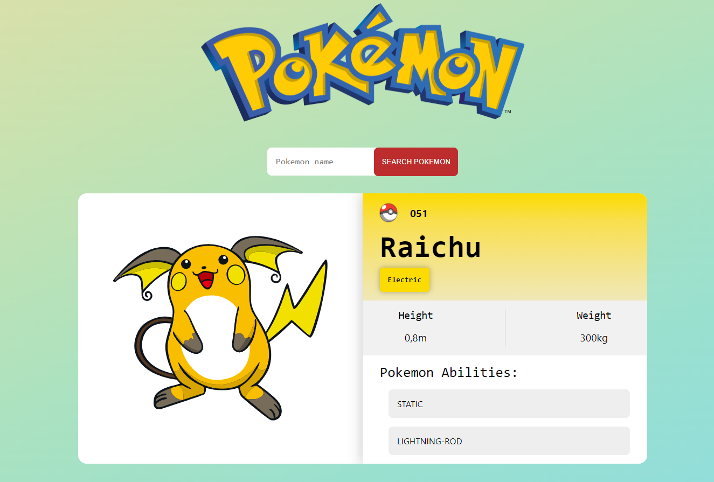

# Pokedex com Javascript Vanilla 🎮

## Preview:

## Descrição:

Projeto criado com JS Vanilla e SASS para facilitar uma futura mudança no estilo do projeto, separando os estilos em módulos diferentes. Projeto totalmente responsivo e dinâmico. Você pode accesar diretamente clicando [Aqui]('https://1maatheus.github.io/pokedex-js-vanilla/').
